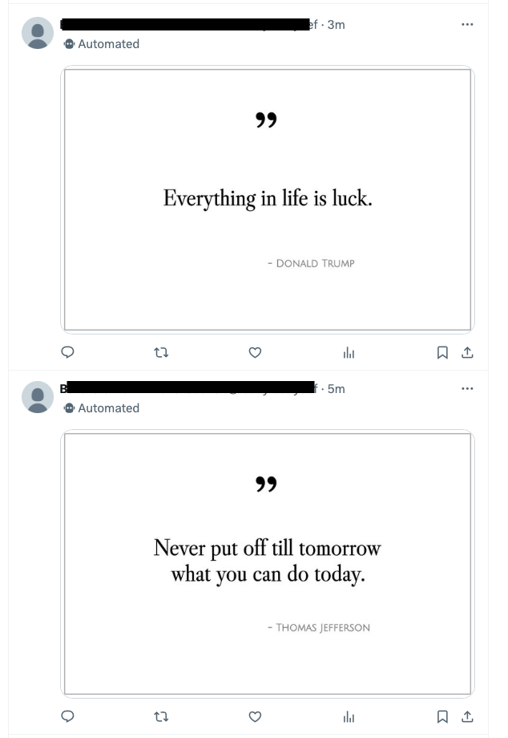

# Quote Pro Quo

QPQ is a simple bot that produces quote images and tweets them.



## What's included

+ The [Astro](astro.build) site that comes with the repo is mostly just a place to
  test out any changes to the design of your tweets, and also quite possibly a place
  where you could post your quotes permanently, so that your tweets could include
  permalinks (though that's not implemented yet).
+ The `scripts` directory contains everything you need in order to start tweeting today.
+ The `post_one.ts` script creates an SVG from a React component.  The SVG is then rendered as
  [.webp](https://en.wikipedia.org/wiki/WebP) before being tweeted.

## Re-Designing the tweet images

+ See `src/lib/ReactQuote.tsx` to change the SVG layout.
+ See `src/lib/prepare_quote.ts` to change the dimensions or characters per line.
+ See `src/lib/fonts/index.ts` to change the fonts.

## Getting Started

### Install Bun

[Bun](https://bun.sh) is a JavaScript runtime that is excellent in many ways.

On macOS, you can get [Bun](https://github.com/oven-sh/homebrew-bun) through [Homebrew](http://brew.sh):

```bash
brew tap oven-sh/bun
brew install bun
```

Otherwise

```bash
curl -fsSL https://bun.sh/install | bash
```

### Clone this repo and install deps

```bash
git clone https://github.com/tylergannon/tweet-pro-quo.git
cd tweet-pro-quo
bun install
cp .env.example .env # This will prepare your .env file which will hold sign-in keys.
```

### Set up your quotes

You need a CSV file with three columns and labeled header row with Author, Quote, and Year:

```text
Quote,Author,Year
"Genius is one percent inspiration and ninety-nine percent perspiration.","Thomas Edison",
"You can observe a lot just by watching.","Yogi Berra",c. 1970
"A house divided against itself cannot stand.","Abraham Lincoln",1860
"Difficulties increase the nearer we get to the goal.","Johann Wolfgang von Goethe",
"Fate is in your hands and no one elses","Byron Pulsifer",
```

Note that the year is optional but the column should be present.

From your project root directory:

```bash
scripts/load_data.ts [path_to_csv_file]
```

### Set up your twitter account

1. Go to [twitter developer site](https://developer.twitter.com) and log in as the bot user.
2. Create a project.  Make sure it has "Limited v1.1 access" and "v2 access":

3. Go into [Twitter settings](https://twitter.com/settings/your_twitter_data/account) as the bot user and make the account a "managed account".

  Follow instructions there and set up a "Managing Account" for the bot.
4. Obtain your OAuth sign in keys and store them in your .env file.
   From the "Keys and tokens" tab, click on generate/regenerate.  Place the resulting values inside of .env
   as `TWITTER_CONSUMER_KEY` and `TWITTER_CONSUMER_SECRET`.


### Log in the client

From your terminal:

```bash
./scripts/login.ts
```

Follow the instructions there.  You'll follow a link to Twitter and return with
a pin code that the software will use to generate its semi-permanent access tokens.
The script will spit out some info like this:

```text
####  Login Successful.   ##########
Add the following to your .env file:

echo "TWITTER_OAUTH_TOKEN=3425256123452346137-21HK9vmRB5FZpGQlLawNJTUSMZvdNr" >> .env
echo "TWITTER_OAUTH_SECRET=Lf3C3XPPGE2234jkl256hl1234kj12341234QlXJ1hkyt" >> .env

####################################

```

As noted, that information should go into your .env file.

### Send a tweet!

```bash
./scripts/post_one.ts
```

This will take a random quote from your database and tweet it,
and also mark the record so that it won't be used again until later.

Start counting RT's!!!!
